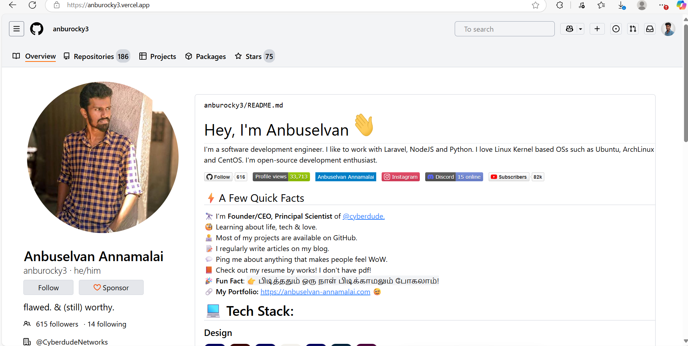

# GitHub Profile Homepage UI Clone

## 📸 Screenshot

This project is a **desktop-only UI clone of a GitHub profile homepage**, created as part of my internship practice.

The UI is inspired by the GitHub profile of my internship company’s CEO,  
**Anbuselvan Annamalai** → [github.com/anburocky3](https://github.com/anburocky3)

## 🔧 Tech Stack
- HTML
- Tailwind CSS

## 🎯 What I Learned
- Structuring a real-world UI layout
- Using **Flexbox** and **Grid** effectively
- Improving spacing, alignment, and consistency
- Writing clean HTML with utility-first CSS

## ⚠️ Notes
- Desktop-only UI
- No responsiveness implemented
- No backend or interactivity
- Built without templates or AI-generated code

## 📌 Disclaimer
This project is created strictly for **educational purposes**.  
All design credits belong to **GitHub**.
